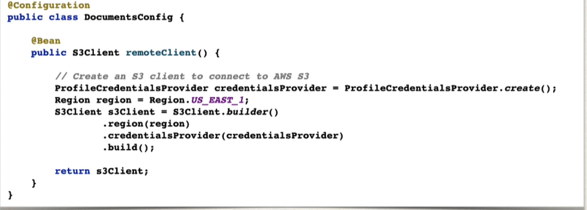

# Spring Framework

## Coupling 
#### Tight coupling
 ```java
public class GreetingService{
    public String sayHello(){
        return "Hello";
    }
}
public class Application{
    public static void main(String args[]){
    GreetingService service =new GreetingService();
    service.sayHello();
    }
}
 ``` 
#### Loose coupling
```java
public interface ServiceInterface{
    public String sayHello();
}
public class GreetingService implements ServiceInterface{
    public String sayHello(){
        return "Hello Spring";
    }
}
public class Application{
    public static void main(String args[]){
    ServiceInterface service =new GreetingService();
    service.sayHello();
    }
}
 ``` 
 <br>
Additional Resources

 [stackOverFlow](https://stackoverflow.com/questions/2832017/what-is-the-difference-between-loose-coupling-and-tight-coupling-in-the-object-o) <br>
 [GeekForGeeks](https://www.geeksforgeeks.org/coupling-in-java/)

 ---

 ## Core  
 #### Inversion of Control
    IoC is a principle, which states that the dependent classes should not create objects of the dependency classes. Dependency objects would be created by either the IoC container or the framework and be provided to the dependent object.
 [link](https://medium.com/@amitkma/understanding-inversion-of-control-ioc-principle-163b1dc97454)   
 #### Dependency Injection
    dependency injection is a technique whereby one object (or static method) supplies the dependencies of another object. A dependency is an object that can be used (a service).
 [link](https://www.freecodecamp.org/news/a-quick-intro-to-dependency-injection-what-it-is-and-when-to-use-it-7578c84fa88f/)
- Types
    - Constructor
    - Field
    - Property

#### Annotations
- @Component, @Controller, @Service, @Repository
- @SpringBootApplication( scanBasePackages={"com.kortin.tech",com.kortin.info}) 
- @Qualifier 
    - for determining the bean to be injected
- @Primary
- @Lazy - > initialize only when needed

#### Bean Scopes
- Singleton (Default)
    - Single instance created
- Prototype
    - multiple instances created
- Request
    - single bean for a http request
- Session
    - single bean for lifecycle of http session
- Application 
    - single bean for lifecycle of servlet conetext
- Websocket
    - single bean to lifecycle of websocket


#### bean for S3


#### ExceptionHandling in Spring Boot
- Annotations
    - @ResponseStatus
    - @ExceptionHandler
    - @Controller Advice

### Additional Resources
[Spring Documentation]( https://docs.spring.io/spring-boot/docs/current/reference/html/index.html) <br>
[SpringApplication](https://docs.spring.io/spring-boot/docs/current/reference/html/features.html#features.spring-application)
[Spring How to](https://docs.spring.io/spring-boot/docs/current/reference/html/howto.html#howto.application) <br>
[Spring boot](https://docs.spring.io/spring-boot/docs/current/reference/html/using.html#using.build-systems) <br>
[Spring boot](https://docs.spring.io/spring-boot/docs/2.1.3.RELEASE/reference/htmlsingle/) <br>


 
